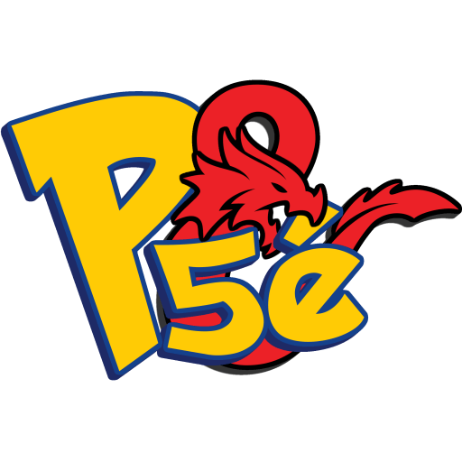
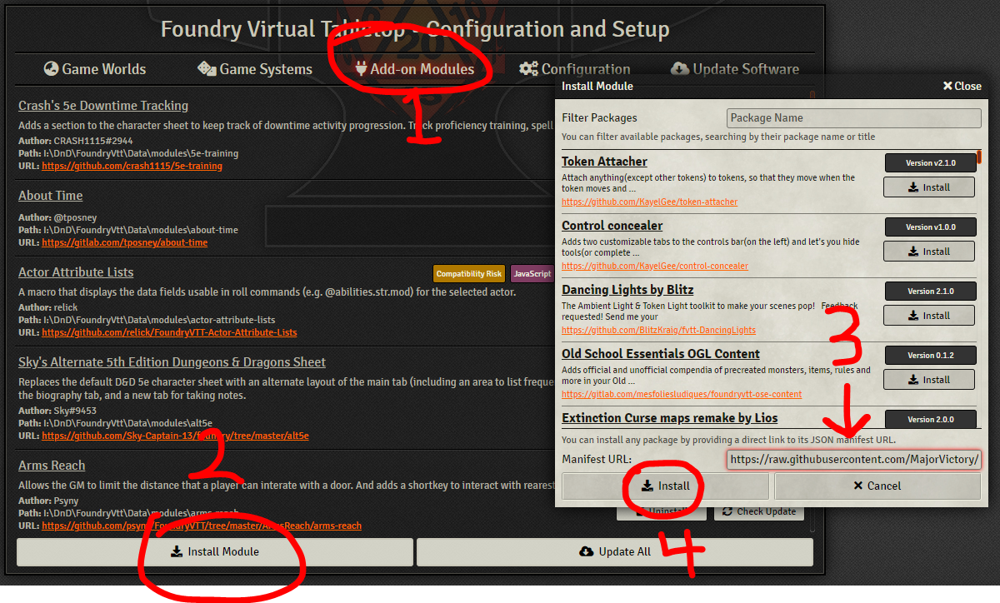
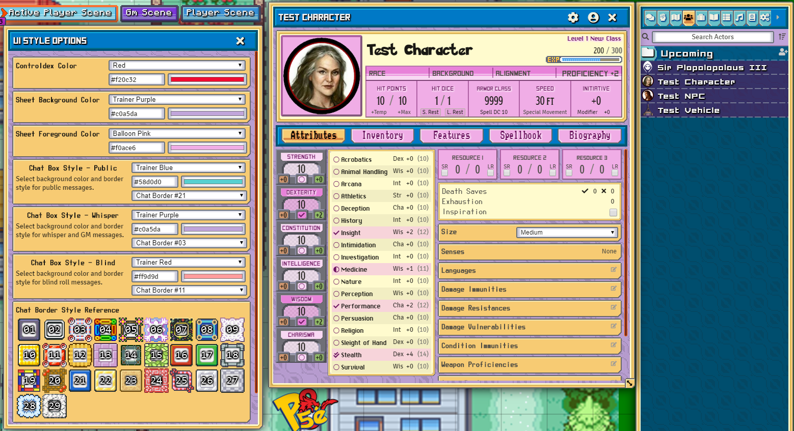
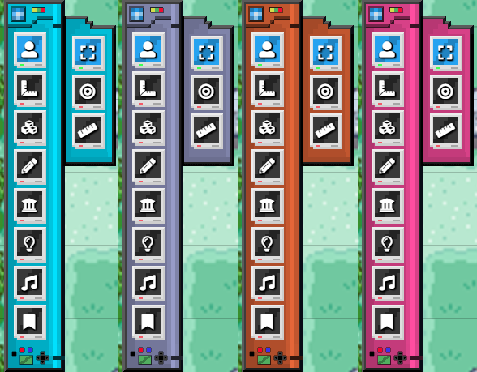
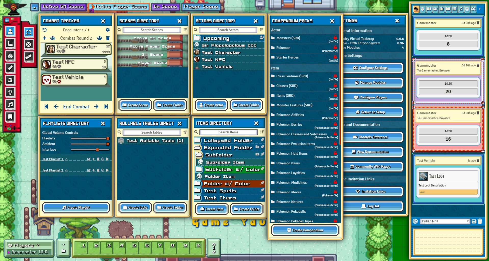
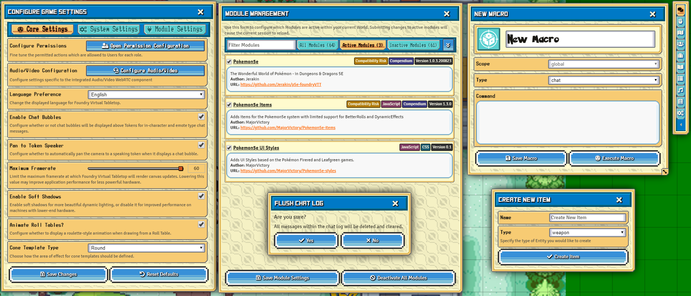

[![foundry-shield]][foundry-url]
[![Forks][forks-shield]][forks-url]
[![Stargazers][stars-shield]][stars-url]
[![Issues][issues-shield]][issues-url]

 

  

  <h3 align="center">Pokemon5e Items module for FoundryVtt</h3>

  

    A module for FoundryVtt that provides compendiums containing over 200 items for the Pokemon5e system with limited support for BetterRolls and DynamicEffects.
     
     
    <a href="https://github.com/MajorVictory/Pokemon5e-styles/issues">Report Bug / Request Feature</a>
  

# Pokemon5e - UI Styles
Adds UI Styles based on the Pokémon Firered and Leafgreen games.

## Installation

### Requirements

**[Compatibility]**: *FoundryVTT* 0.6.5  

**[Systems]**: *dnd5e*

**[Required Modules]**
 * None
 
**[Recommended Modules]**
 * [Jerakin's Pokemon5e Module](https://github.com/Jerakin/p5e-foundryVTT) - Moves, abilities, and pokemon compendiums
 * [My Pokemon5e Items Module](https://github.com/MajorVictory/Pokemon5e-items) - Items, tables, and resources.

### Latest Release: V1.0.0

You can download the module in it's current state by pasting the following manifest url into Foundry.

> https://raw.githubusercontent.com/MajorVictory/Pokemon5e-styles/master/module.json

## Changelog

[Previous Versions Changelog](CHANGELOG.md)

## Screenshots 

### Character sheets

### Customizable Colors

### All Vanilla Menus and Dialogs 

[foundry-shield]: https://img.shields.io/badge/Foundry-v0.6.5-informational
[foundry-url]: https://foundryvtt.com/
[forks-shield]: https://img.shields.io/github/forks/MajorVictory/Pokemon5e-styles.svg?style=flat-square
[forks-url]: https://github.com/MajorVictory/Pokemon5e-styles/network/members
[stars-shield]: https://img.shields.io/github/stars/MajorVictory/Pokemon5e-styles.svg?style=flat-square
[stars-url]: https://github.com/MajorVictory/Pokemon5e-styles/stargazers
[issues-shield]: https://img.shields.io/github/issues/MajorVictory/Pokemon5e-styles.svg?style=flat-square
[issues-url]: https://github.com/MajorVictory/Pokemon5e-styles/issues